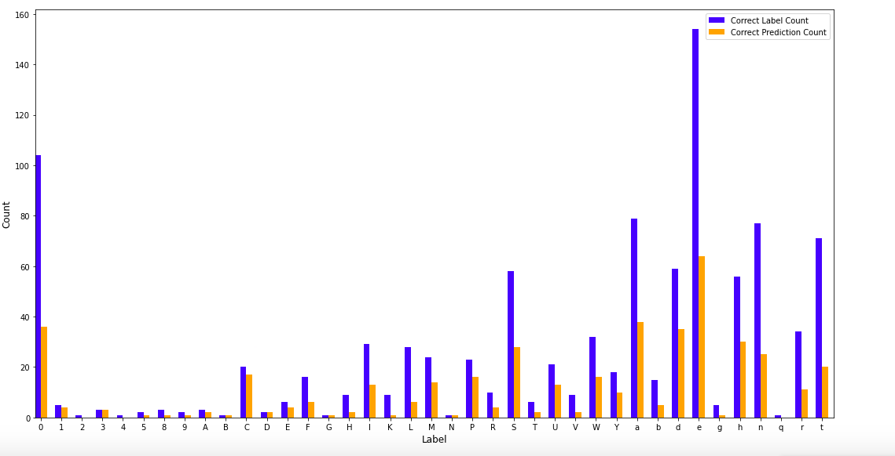

# Using CRAFT on IAM dataset

## Problem and Solution
In order to create more variability for our model, we sought for more handwritten characters datasets but found very few resources. We did find some, but they were in other languages. In order to solve this problem, we resorted to using CRAFT to extract characters from images of handwritten words. We chose the IAM dataset to perform this task on. 

## Result
- We were unable to extract all of the characters in the words, perhaps because of the imperfection in our CRAFT model. The majority of the characters were extracted from clearly written words. Words that had letters stick together provided too little space between letters to draw bounding boxes on, and so we drop those words, too. 
- This is a screenshot of the images that we extracted using CRAFT. 

## Testing
- Using our model that was trained on EMNIST_bymerge dataset on the first 1000 images of the new IAM characters dataset, we were able to reach around 40% of accuracy. This wass due to the difference between the writing style between EMNIST writers and IAM writers. Another reason was that our model tend to make mistakes when it came to similar-looking characters such as letter "o" and "O" and number "0". 
- In the picture below, letter "o" and "O" have been merged into the same class as number "0". The same merging principle that took part in the transformation of EMNIST_byclass into EMNIST_bymerge was also applied. As you can see, letter "a" and letter "e" appeared most frequently, and our model did quite bad on predicting them, thus lowering the accuracy score significantly.

- We will try to use parts of the IAM characters dataset as an addition to the training set of our existing model to see if we can reach a better score. 
